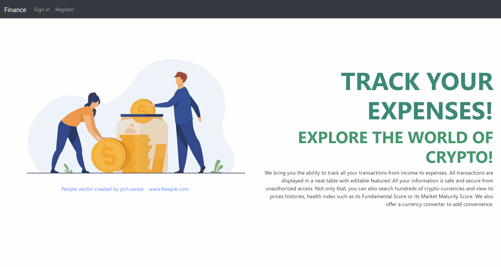
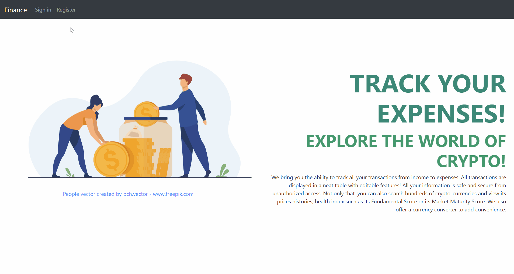
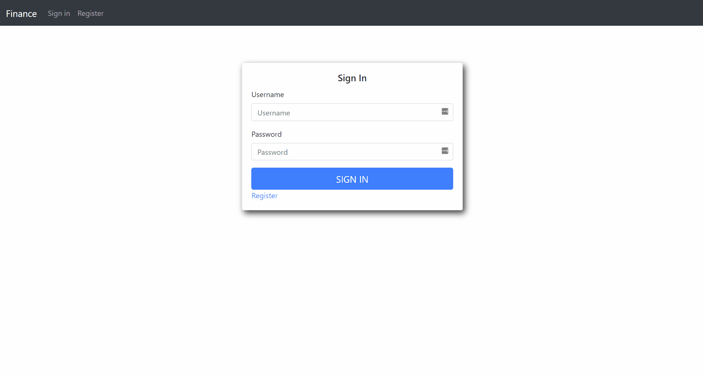
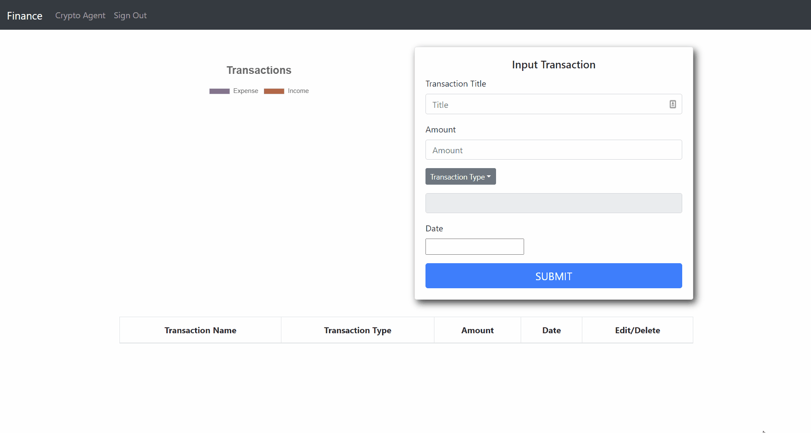
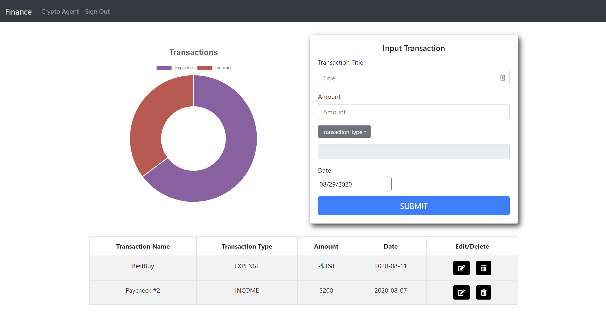

# MERN Stack Finance Tool

## Description
A finance tool made using the MERN stack
- Secure login and registration using the PassportJS JWT strategy; passwords are hashed using bcrypt
- Keep track of all your transactions displayed clearly in a table and charts using chartjs
- View price history and health index of hundreds of crypto coins
and use the built in currency conversion tool

## Demo

### Login Demo
Used the Passportjs JWT strategy for authentication

### Registration Demo

### Error Checking Demo

### Transaction Input Demo
Transactions are visualized using chartjs

### Edit/Delete Transaction Demo

### Crypto Currency Dashboard Demo
Coin data is from the [Alpha Vantage API](https://www.alphavantage.co/)
and displayed using chartjs

### How To Deploy?
Create a .env file in the backend folder and add your own MongoDB key which links to your own MongoDB database.
Also create and add a secret key to the .env file used for password hashing by bcrypt. This is also where your api key will be stored.
